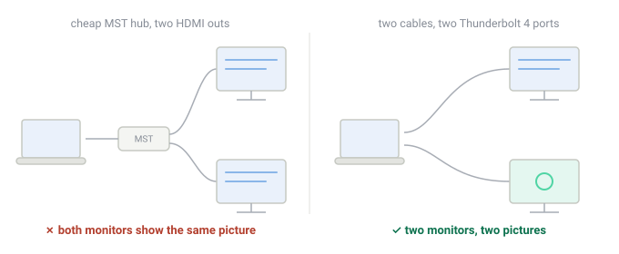

import ProductCard from '../../components/ProductCard.astro';

> **Based on** Apple's support page *How many displays can be connected to MacBook Air* (support.apple.com/en-us/122212, M4 and M5 sections) and Apple's M3-specific article *Use dual monitors with your MacBook Air and MacBook Pro with M3 chip* (support.apple.com/en-us/117373, published July 2024). Both are quoted below.\
> **My own machine** MacBook Air 13″, M4, 16 GB / 256 GB — one external display over HDMI through a cheap dock, 19 months. **I have never run two external displays at once**, so nothing in this article is a hands-on claim about a dual-display setup. It is a correction of what the specs say, with the source named.

## The short answer

| MacBook Air | External displays | Lid |
|---|---|---|
| **M1, M2** | 1, natively | — |
| **M3** | 2, but only in clamshell mode | **must be closed**, with four other requirements |
| **M4** | 2, alongside the built-in display | open **or** closed — closing adds nothing |
| **M5** | same as M4 | same as M4 |

If you have an M4 or M5 Air and you have been told you need to close the lid to run two monitors: **you do not.** That rule belongs to the M3, and it is the single most repeated piece of wrong advice about this laptop.

## Where the wrong advice comes from

Apple publishes a page titled *Use dual monitors with your MacBook Air and MacBook Pro with **M3 chip***. Its opening sentence is:

> "You can connect two external displays simultaneously when you close the lid of your MacBook Air or MacBook Pro with M3 chip."

That page is accurate, it is Apple's, and it is the page that ranks for dual-monitor questions on the Air. It opens with the clamshell requirement, it lists five steps that end with "close the laptop lid", and it contains this warning:

> "If you open the laptop lid when both displays are connected, the secondary external display will go dark or disconnect."

Now watch what happens downstream. Someone writing a guide about the **M4** Air searches "macbook air two external displays", lands on Apple's page, reads the clamshell rule, and carries it over — dropping the chip qualifier in the title because their article is about the Air, not about a chip. The result is a large pile of pages that are correct about the M3 and wrong about the machine you are actually considering. This is the most common way spec errors spread: not invented, inherited.

The M3 rule is worth stating precisely, because M3 owners genuinely need it and nobody needs it by accident:

- an external keyboard and mouse or trackpad
- macOS Sonoma 14.3 or later (Air) / 14.6 or later (13-inch Pro with M3)
- display power over USB-C, or a USB-C to MagSafe cable and an adapter
- connect the keyboard and mouse, connect power, connect the **first** display, close the lid, then connect the **second** display — in that order
- the second display is capped lower than the first: 5K at 60Hz or 4K at 100Hz, against 6K at 60Hz or 4K at 144Hz for the primary

Every one of those conditions exists to work around a hardware limitation of the M3. None of them apply to the M4.

## What Apple actually documents for the M4 and M5

Verbatim from the current support page, for both chip generations:

> "MacBook Air models with the M4 chip support up to two external displays simultaneously in addition to the built-in display... **Closing the lid of your MacBook Air with M4 chip will not increase the number of external displays that can be supported.**"

The resolutions are worth having in front of you when you buy cables:

| Configuration | Supported |
|---|---|
| Two external displays | up to 6K (6144 × 3456) at 60Hz, or 4K at 144Hz, **each** |
| One external display | up to 8K at 60Hz, 5K at 120Hz, or 4K at 240Hz |

So the honest ceiling is **three screens at once** — the 13.6-inch built-in panel plus two externals — and the honest footnote is the one Apple adds: a hub or daisy-chaining can carry two displays over a single Thunderbolt port, but it **cannot raise the two-display maximum**. Buying a four-output dock will not get you a fourth screen. There is also a practical note in that line: connect the highest-resolution display first.

## The trap that catches M1, M2, M3 and M4 alike

This is the part the spec table never mentions, and it is why people conclude "two monitors on a Mac does not work".

Cheap multi-display USB-C hubs split one DisplayPort stream into two outputs using a technology called **MST**. It works on Windows. macOS does not do MST: connect a hub like that and the second monitor either **mirrors the first or stays dark**, no matter what Displays settings says. Apple's own troubleshooting note for the M3 acknowledges the mirror symptom and gives the fix — connect the display directly to a port on the Mac rather than through the hub.

The signals to look for before buying:

- A hub that advertises "dual HDMI" or "two displays" without naming Thunderbolt is almost certainly MST. If the listing says MST, or says nothing about the technology, assume it will mirror.
- A genuine **Thunderbolt** dock drives two displays properly and needs no driver. Expect to pay real money for one.
- **DisplayLink** docks work differently again: they use a driver instead of the GPU's native outputs, and they are the only way to get two external displays on an M1 or M2 Air. They work, with a driver to install and maintenance to keep up with — a different trade, not a free one.

## The cheapest setup that actually works

Because the M4 Air charges over **MagSafe**, both Thunderbolt 4 ports stay free. That makes the cheapest correct dual-display setup two cables and nothing else:

1. Two USB-C to DisplayPort (or USB-C to HDMI) cables.
2. One into each Thunderbolt 4 port, straight into each monitor.
3. Charging over MagSafe, so neither port is spent on power.

No dock, no driver, no display order to get right, lid open or shut. The cost of that approach is ports: with both Thunderbolt ports carrying video, a wired keyboard, mouse, drive or Ethernet connection needs a separate USB-A adapter. If you want one cable for everything, that is what a Thunderbolt dock is for — and the MST warning above is what you are paying to avoid.

## How to check your own Mac in two minutes

Do not take my table, or a blog's table, as the answer for your machine:

1. **Identify the model** — Apple menu → About This Mac. Apple's page *Identify your MacBook Air model* (support.apple.com/en-us/102869) maps the model identifier to a name and year.
2. **Read the spec for your chip** — Apple's display page, under your chip's heading. This is the only source that matters, and it is one page.
3. **Check what your Mac is actually driving right now** — About This Mac → More Info → System Report → **Graphics/Displays** lists every display the machine sees, its resolution and its refresh rate. If a monitor you have plugged in is not in that list, the problem is the hub or the cable, not the laptop.

## What I can and cannot tell you first-hand

I run **one** external display — a monitor over HDMI through a cheap dock — and in 19 months it has never flickered, failed to wake, or dropped out. That is the entire extent of my hands-on evidence, and it is also why the M4 review says one display and not two.

<ProductCard
  name="A $12 no-name USB-C dock with HDMI"
  verdict="One display over HDMI, 19 months, zero drama. It is the only dock I have actually run on this machine — and that is all I can vouch for."
  rating={4}
  basis="hands-on"
  pros={[
    'No driver, no setup — it has worked since the day it was plugged in',
    'One display over HDMI: no flicker, no failed wake-ups in 19 months',
    'Cheap enough that replacing it is not a decision',
  ]}
  cons={[
    'One HDMI port — it cannot answer any two-display question',
    'A single USB-A port on the side, and that is the whole expansion story',
    'Untested with two displays, because I have never owned two to try',
  ]}
/>

What I cannot tell you: how a dual-display setup behaves on this machine day to day, whether a specific dock works, or how it handles sleep with two monitors attached. Those answers come from the spec page and from people who run the setup — not from me. If you are about to spend money on a dock, buy from somewhere you can return it.

## Who this is for / who should skip it

**Worth reading if:**

- You are buying an M4 or M5 Air and were told the lid has to stay closed for two monitors.
- You have an M3 Air and want the clamshell requirements listed in one place, in order.
- You are on an M1 or M2 and wondering why your second monitor mirrors. The answer is MST, and the workaround is DisplayLink or a different laptop.

**Skip it if:**

- You want a dock recommendation for a specific model — I have not tested one, and I am not going to guess. Pick by the technology, then buy somewhere returnable.
- You are on a MacBook Pro with a Pro or Max chip. The display limits that make this article interesting mostly do not apply to you.

## Update log

- 2026-10-11 — first published, against Apple's M4/M5 display page and the M3 dual-monitor article.

---

{/* ═══ 硬约束检查（2026-10-11）═══
     1. 本文不含任何第一人称双屏使用口吻 —— 开头已声明「只跑过一台外接屏」，
        与 /setup/macbook-air-m4/ 里「I have never driven two external displays」一致。
     2. 全部规格引自 Apple 官方两页，已在开头点名；若 Apple 更新页面，
        以新页面为准并加 updatedDate。
     3. 内链：正文未强插，靠自动 siblings（同 cluster）与本篇的描述性链接。
     4. 若将来真的接了双外接屏：把第 8 节改写成实测，并把标题里的「guides」定语删掉。
     5. ProductCard 仅 .mdx 可用；MDX 里 HTML 注释要写成 JSX 注释（本块）。 */}
