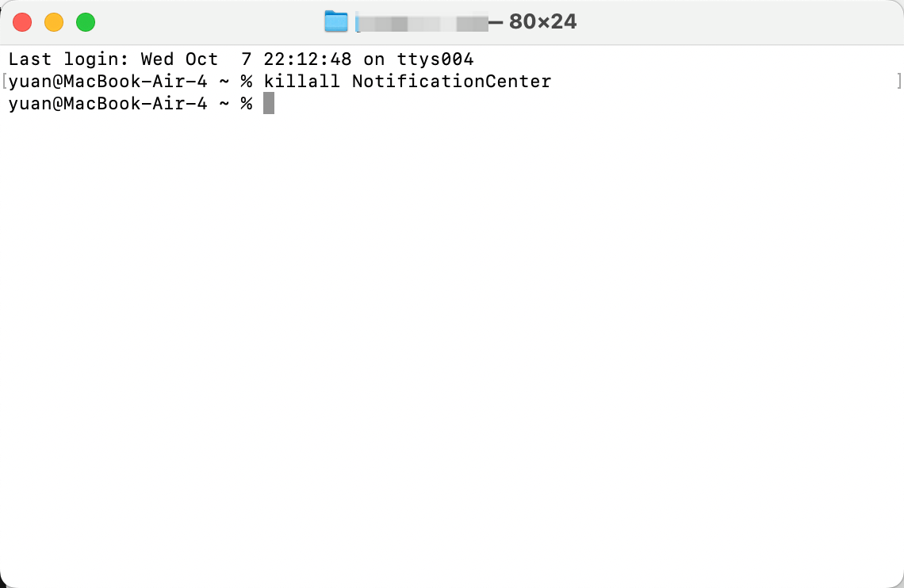

> **In use since** March 2025 · **Paid** ¥7,999 · **Model** MacBook Air 13″, M4, 16 GB / 256 GB\
> **Runs with** macOS 15.7 (Sequoia)\
> **Time on it before writing this** ~19 months of daily use

## What I needed it for

Most laptop advice assumes you have exactly one job. Designers are told to buy for colour, developers for cores, students for price. My work is not any of those. It is a bit of everything — writing, a browser with too many tabs open, a terminal, and long stretches of all three happening away from a wall socket.

That is the hardest brief to buy for, because "a bit of everything" does not map to a spec sheet. It maps to a set of small, repeated annoyances.

What I was replacing: an older MacBook. If you are coming from one too, the two rows that matter most in the table below are the ones about the fan and the memory — everything else on this machine is comfortable at the price and not worth arguing about.

The bar it had to clear: do a full day of mixed work on one charge **without carrying the charger that came in the box**, stay completely silent while doing it, and be light enough that carrying it is never a decision.

## The short answer

| | |
|---|---|
| **Solved the problem?** | Yes |
| **Would I buy it again** | Yes — but if I were replacing it tomorrow, I would pay more for the M5 (see the last section) |
| **What I'd pay for it** | ¥7,999 — which is exactly what I paid at launch |

**If your setup looks like mine, this is worth it because** — your work is a mixture rather than one sustained heavy task, you would rather have a silent machine than a fast one, and you carry the laptop often enough that weight matters. The Air was never built to hold a load forever, and if you never hand it a load to hold, the compromise you paid for is one you will never see.

**Skip it if** — you keep a compile, an export, or a model resident for hours at a time, or your daily working set needs more than 16 GB. There is no fan inside, so under a sustained load the Air slows down instead of getting loud. That is the entire trade, and it is only the right trade if you do not push it.

## What it is

<!-- 参数均引自 Apple 官方发布页与 apple.com.cn 规格页（2025-03-05）。
     三方目录站和 best-X 聚合页不是来源。 -->

| | |
|---|---|
| Model | MacBook Air 13″ (2025), Apple M4 |
| Price paid | ¥7,999 — Apple's China launch price for this configuration |
| Chip | M4 — 10-core CPU, 8-core GPU in this configuration, 16-core Neural Engine |
| Memory | 16 GB unified (configurable to 32 GB) |
| Display | 13.6″ Liquid Retina, 500 nits, 1 billion colours |
| Dimensions / weight | 1.24 kg / 2.7 lb (13″; the 15″ is 1.51 kg / 3.3 lb) |
| Power | Fanless. Up to 18 hours (Apple's figure) |
| Connection | MagSafe, 2 × Thunderbolt 4, 3.5 mm jack; Wi-Fi 6E, Bluetooth 5.3 |
| External displays | Up to two 6K, alongside the built-in screen |
| What's in the box | MacBook Air, matching MagSafe cable, power adapter |

Two of those rows are the ones that decide whether this machine is for you, and neither is the chip. **The fanless design** sets the ceiling for anything sustained. **The memory** sets the ceiling for how much you can keep in play at once. Everything else on that table is comfortable at this price and not worth arguing about.

<div style="border:1px solid #d8dee4;border-radius:12px;padding:18px 20px;margin:32px 0;background:#f6f8fa;">
<p style="margin:0;font-size:15px;color:#57606a;"><strong style="color:#1f2328;">A note on timing.</strong> The M4 Air is no longer the current model. Apple moved the line to M5 in March 2026, and on 25 June 2026 it raised prices across the Mac and iPad line — the MacBook Air went from $1,099 to $1,299 — citing memory and storage costs driven by AI data-centre demand. Two things follow for anyone reading this now. Buying any Mac has become more expensive than it was. And an M4 Air found on clearance or refurbished is a better deal than it was the day I bought mine. That makes the useful question not "is the M4 fast" but "is the M4 still the right buy" — which is answered further down.</p>
</div>

## Where it holds up

- **A full day, and the charger stays at home.** A mixed day of writing, browsing and terminal work runs on one charge, so the adapter that came in the box lives in a drawer. When I do need a top-up, a phone USB-C charger works on this machine — it is slow, but it works, and it means one charger covers the laptop and the phone in the same bag.
- **Silent. Not quiet — silent.** There is no fan to spin up, so nothing I do to it can announce itself. I have worked in a room with other people on calls, in the evening, in quiet rooms, and it has never once made a sound.
- **It gets warm, and that is the entire penalty.** After a long stretch it is noticeably warm to the touch, and I expected that to turn into stutter. It did not. Warm, and still responsive — that is the whole trade, and it is a much better trade than the spec sheet suggests.
- **Light enough that carrying it is never a decision.** 1.24 kg in a 13-inch body, thin enough to disappear into a bag, so it lives in the bag. That is the least discussed number in this article and the one that changed the most about how I actually work.
- **Open the lid and you are already working.** No warm-up, no waiting for it to settle, no "let me plug it in first." It wakes and it is there, every time — which is the whole point of a machine you carry.
- **One external display, and it never hiccups.** I drive a single monitor over HDMI through a cheap dock, and there is no lag, no flicker, no display that fails to wake. Apple advertises up to two 6K displays; I only ever use one, and that is the honest boundary of what I can tell you — it is in "What I didn't test" as well.

## Where it broke, or where I gave up

This is the section that decides whether a review is worth reading, so here is the honest version: **nothing has broken.** In 19 months I have not hit thermal throttling, I have not run out of memory, and it has never locked up because it got warm.

But there is one thing that never went away, and it is not the M4's fault.

**Notification Centre bounces.** Every so often a notification banner sticks — it pops up and then refuses to fade out, or a pile of them lands on the corner of the screen at once and stops responding. It fixes itself after a few seconds, or it doesn't fix itself until I make it.

The making-it part costs one line in Terminal:

```bash
killall NotificationCenter
```

That force-quits the notification process, and macOS restarts it on the spot — no logout, no reboot, nothing lost. It takes effect immediately:



Worth being precise about all of this, because it is the kind of thing that gets blamed on the wrong component. This is a **macOS** problem, not an M4 problem and not an Air problem. It shows up on fanless and fan-cooled Macs alike, and it has survived every macOS update I have installed since I bought the machine. If you are deciding between this laptop and another, this is not a reason to avoid it — it is the same glitch you would inherit on any Mac, along with the same one-line fix.

Here is one more detail that says more than the complaint does: I am still on macOS 15.7, while Tahoe has been the current release for a while. Nothing has pushed me to upgrade. That is not a recommendation — it is just the state of a working machine that has not given me a reason to spend an evening on it.

That is the whole list.

<!-- 若之后又想起别的卡点（某个外设在合盖时不认、某次更新后快捷键变了、某个 app 在内存压力下要重开），
     加在这里并更新 frontmatter 的 updatedDate。想不起来就保持现状 —— 不要为凑数编一条出来。 -->

## What it cost

- Purchase price: **¥7,999** — Apple's official China launch price for the 13-inch, 16 GB / 256 GB configuration. The same configuration launched at $999 in the US, which is the number you will find in almost every English review.
- Extra spend it forced on me: **$12.** That is the whole figure. One cheap dock with an HDMI port for the monitor and a single USB-A port on the side. It is the only thing I have bought for this machine, and there is no case, no second charger, and no stand in that number.
- Returned or replaced? How many times: none.
- **Hours it cost me** (setup, migration, debugging, researching): half a day, everything included.

<!-- 时间成本通常比价格重要一个数量级，但几乎没人写。 -->

## What I didn't test

- I did not run a benchmark suite, and there are no synthetic scores anywhere in this piece on purpose.
- I did not test it under sustained export or render loads — that is not what I do, so I cannot tell you where the fanless design starts to hurt. If that is your work, treat this review as not relevant to you.
- I have only used this one configuration — 16 GB of memory and a 256 GB drive, which is also the only 13-inch configuration with an 8-core GPU rather than a 10-core one. I cannot say whether the faster GPU or the larger memory changes any of the above.
- On storage, one measured number instead of an opinion: after 19 months, my data volume holds 145 GB. The question of whether 256 GB is enough has an answer for my workload, and it is yes — but it is my workload, not yours.
- I have never driven two external displays at once, and I have never attached more than one USB device to the dock at a time. Apple advertises up to two 6K displays; I can only confirm the single-display case.
- Everything above is one person's machine and one person's workflow. The sample size is one.

## Who this is for / who should skip it

**Worth it if:**
- Your work is a mixture, and no single task in it is heavy enough to run for hours.
- You value silence and battery life over peak performance.
- You want the maximum amount of Mac for the minimum amount of money, and you are willing to buy a generation behind to get it.
- You want to drive an external display from a fanless laptop without buying an expensive dock — a cheap one was enough here.

**Skip it if:**
- You keep a long-running build, export, or local model in the foreground. Buy the model with a fan.
- You need more memory than 16 GB for your daily working set. This is the one thing you cannot fix later.
- You want the longest possible software-support window — that argument now belongs to the M5.
- You buy on the assumption that more cores will feel faster. For mixed work, they mostly will not.

## If it dies, what I buy instead

**I would pay more for an M5 Air.**

Not because this machine disappointed me — quite the opposite. The M4 Air proved that all of my work fits inside a fanless laptop. Once you know that, the next purchase stops being about whether the shape is right and starts being about how long it lasts. And on that question this machine is the older one: it is a generation behind, so whatever the M5 receives in the way of new features and years of software updates, the M4 will receive strictly less of.

Two specific things I would be buying with the extra money, and neither is speed:

- **The software window.** I have never once felt this machine be slow. What I would be paying for is time — more years of current macOS, which is what actually decides when a laptop stops being usable.
- **The storage, not the memory.** The M5 Air starts at 512 GB where mine started at 256 GB. Nineteen months in, the number I have had to think about is the drive, not the RAM, and if I am buying a machine to keep for four or five years, that is the column I would rather not repeat.

Now the arithmetic, because it is less comforting to the M4 than I expected when I started writing this section. At launch my configuration was ¥7,999. The current M5 Air starts at ¥8,499 — with twice the storage. That is not a gap you can build a case on. The M4 wins only if you find a discounted or refurbished one, or if the cheapest working Mac is the entire brief and you want nothing else from it.

So the honest ending to an M4 review written in 2026 is this: the machine has been exactly right for me for 19 months, and if I were buying today I would not buy it. Both of those are true, and you should weigh them separately.

## Update log

- 2026-10-09 — first published, after 19 months of daily use.
