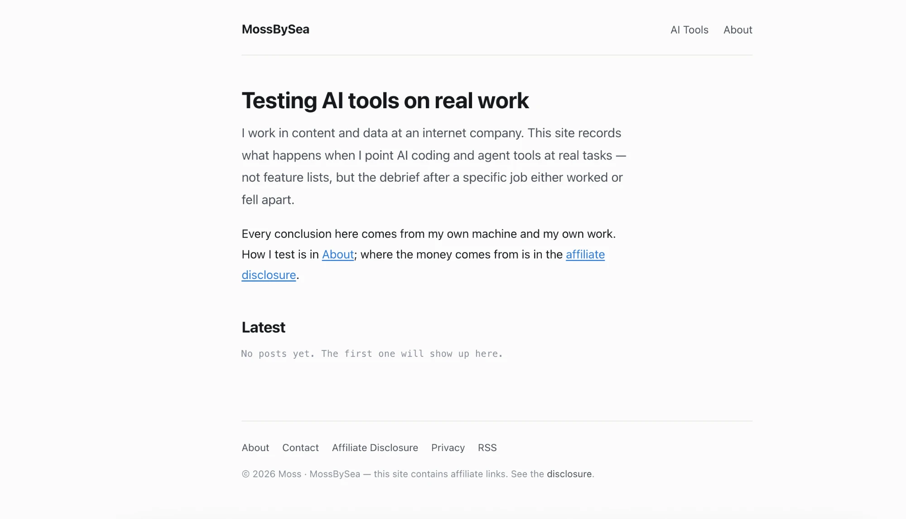
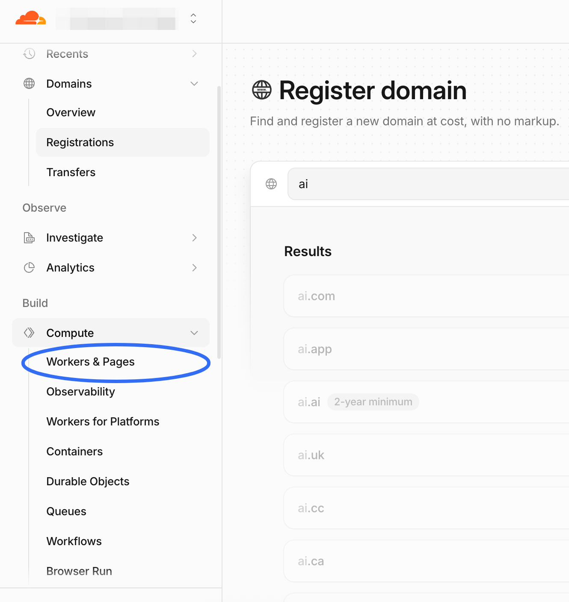
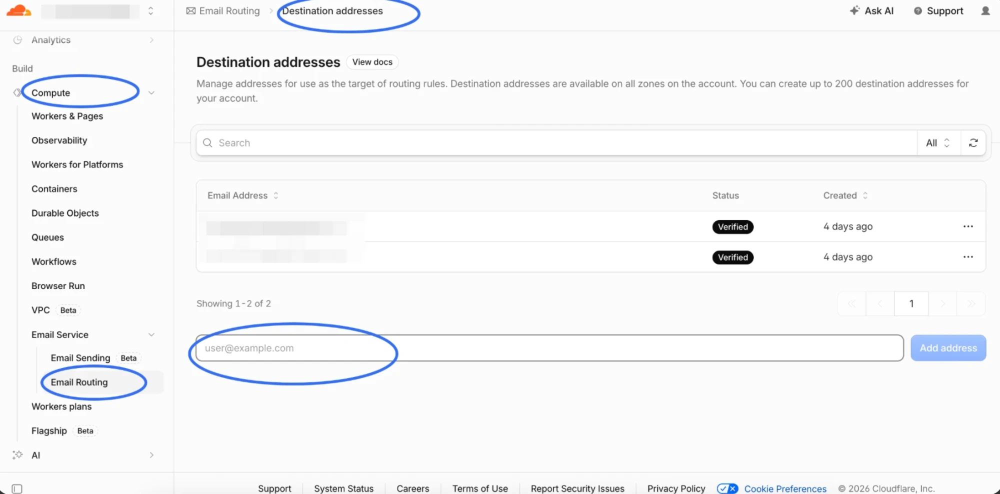

> **Built** 2026-09-22\
> **Stack** Astro 5 static build · Cloudflare Workers with static assets · Cloudflare Registrar · Cloudflare Email Routing\
> **Total cost** $10.46/year, all in

This site went from an empty folder to a live domain with a working inbox in an afternoon. The building part was fast. The part that ate the time was eight specific things going wrong, and most of them are not in any tutorial I could find — one of them is actively caused by advice that's everywhere.

Writing them down while they're fresh.

## What I actually built

Nothing exotic:

- **Astro 5**, static output. No database, no server, no CMS.
- **Cloudflare** for hosting, DNS, registrar, and email forwarding.
- **GitHub** for source. Push to `main`, it deploys.

Running cost is the domain and nothing else. Static hosting on Cloudflare's free tier has unlimited bandwidth and 500 builds a month, which is more than a daily writer will use.



That's the whole thing. It is not complicated. Getting it there was.

---

## 1. The dashboard moved, and Pages is being folded into Workers

I went looking for **Workers & Pages** in the Cloudflare sidebar. It isn't there any more — the nav has been reorganised into Observe / Build / Protect & connect groups, and I landed on **Workers AI** twice before finding the right place.

It now lives under **Build → Compute**.

More importantly: Cloudflare is merging Pages into Workers. As of March 2026, Workers has feature parity with Pages for static assets, SSR, and custom domains. Connecting a Git repo today may well create a **Worker with a static-assets binding** rather than a Pages project. Mine did — the Overview page showed `Bindings 1 → Assets: ASSETS`, which is the tell.

This doesn't break anything for a static site. But it means half the tutorials you'll read describe a UI that no longer matches what's on your screen.

**What to do instead of hunting through menus:** hit `⌘K` and type what you want. The quick search is immune to nav redesigns.



It's two levels down now, under a group heading that doesn't mention hosting.

---

## 2. It deployed successfully, and the site was unreachable

The build went green. The Worker existed. The Git integration said it had synced seconds ago. And there was no way to open the site, including for me.

I sat looking at a successful deployment and a dead URL for longer than I'd like to admit.

The clue was a small badge at the top of the Overview page: **"No URLs enabled"**, and under Domains and routes, `workers.dev` marked **Disabled**.

A freshly created Worker isn't served at any address by default. You have to turn one on.

**Fix:** enable the `workers.dev` subdomain first, before you touch your real domain. You get something like `project.account.workers.dev`, and you use it to confirm the *build* is fine. That separates two failure modes that otherwise look identical — a broken build and a broken DNS config. Debugging them together is miserable.

Then add the custom domain, confirm it works, and turn `workers.dev` back off (see #6 before you do — there's a trap).

---

## 3. Cloudflare Email Routing cannot send

Affiliate networks want a contact address on your own domain. A Gmail address measurably hurts your approval odds. So: `hello@mydomain.com`.

Cloudflare Email Routing gives you that for free — 200 custom addresses, 200 destination addresses, unlimited forwarding volume. Five minutes of setup.

**It only receives.** There is no sending. When you hit reply in Gmail, the message goes out as `you@gmail.com`, with your Gmail address visible to whoever you're replying to.

I found this out by replying to my own test message.

For getting approved this is fine — reviewers send a test message and check it arrives. For actually corresponding with brands it looks amateurish.

**If you want to send from your own domain**, you need an SMTP relay behind Gmail's "Send mail as":

1. Sign up for a relay — Brevo (300/day free) or Resend (3,000/month free).
2. Gmail → Settings → Accounts and Import → **Send mail as** → enter the relay's SMTP host, port, username, password.
3. Add **DKIM** and **DMARC** records in Cloudflare DNS using the values the relay gives you. (SPF is already there from Email Routing.)
4. Test at [mail-tester.com](https://www.mail-tester.com/). Under 8/10, fix what it flags.

Skip step 3 and your mail lands in spam.

---

## 4. The "destination address" field is not the address you're creating

This one is a UI trap and I nearly got it wrong.

Email Routing's **Destination addresses** tab has a single input that says `user@example.com`. The obvious read is that this is where you define your new address.

It isn't. It's where mail gets forwarded **to** — your existing Gmail.

I read the page three times and still had it backwards.

```
Destination address  →  your existing inbox        (this field)
Routing rule         →  hello@yourdomain.com       (a separate tab, later)
```

Put `hello@yourdomain.com` in that box and you've created a forwarding loop to an address that doesn't exist yet.

**Order that works:** add your Gmail as a destination → **click the verification link Cloudflare emails you** → then go to Routing rules and create `hello@`. Add a catch-all rule too, so mail to `contact@` or a typo'd address doesn't silently vanish.



One input, one placeholder, and no hint anywhere on the page about which of the two addresses it wants.

---

## 5. The registration email trap that can lose you the domain

ICANN requires registrant contact data to be accurate, and it requires you to **verify the registrant email within 15 days**. Miss that window and the domain is suspended. Knowingly false data can get it cancelled outright.

The trap: you're registering `yourdomain.com` and you're about to set up `hello@yourdomain.com`, so it's tempting to enter that as your contact address.

**That mailbox does not exist yet.** The verification email goes nowhere, you never click it, and fifteen days later the domain you're building on stops working.

Use an address you can already receive at. You can change it later.

Two related things worth knowing, because the folk wisdom here is out of date:

- **Your real details aren't public.** WHOIS was formally retired on 2025-01-28 and replaced by RDAP, which has tiered access — personal contact data is masked from ordinary queries and disclosed only to authorised parties through a compliance process. Layer the registrar's free privacy service on top and public lookups show the registrar, the dates, and the nameservers.
- **This is "not public", not "anonymous."** The registrar holds your real data, and it's obtainable by law enforcement. Fine for keeping a side project off a casual search; not a shield.

---

## 6. Turning off workers.dev took down www — Error 1016

This is the one that cost me the most, and it was caused by doing the thing everyone recommends.

Standard advice, which I'd repeat: once your real domain works, disable the `workers.dev` subdomain. Two addresses serving identical content is a duplicate-content problem.

So I disabled it. And `www.mydomain.com`, which had been returning 200 twenty minutes earlier, started returning:

```
Error 1016 — Origin DNS error
Cloudflare is currently unable to resolve your requested domain
```

**Cause:** `www` had been set up as a **CNAME pointing at the workers.dev subdomain**. Disabling workers.dev deleted the target. The CNAME was left pointing at nothing, and Cloudflare — which still proxies the hostname — had nowhere to send the request.

Error 1016 always means this: the hostname is on Cloudflare, but the record it's supposed to resolve to can't be resolved.

**Two ways out:**

- **Fix it.** Delete the broken `www` record, then add `www.yourdomain.com` as a **Custom domain on the Worker** rather than hand-writing a DNS record. Cloudflare creates a correct record and issues a certificate, with no dependency on workers.dev.
- **Drop it.** Delete the record and don't replace it. Every page already emits `<link rel="canonical">` pointing at the apex domain, so search engines consolidate there regardless. The only loss is that someone typing `www.` gets a "server not found" — which is *better* than the error page they get today.

I took the second option. An error page is worse than nothing.

The part that stung: twenty minutes earlier `www` had been fine. I broke it by following advice I still think is correct.

**If you delete a DNS record, delete only that one.** The same list holds the record serving your apex domain and the MX and TXT records running your email. Removing the wrong row takes the site or the inbox down instantly. I verified afterwards that all three MX records and the SPF TXT record were still intact — worth doing.

---

## 7. "The deploy didn't work" was my browser cache

After pushing a large content change I loaded the site and got the previous version. Git said the commit was on `origin/main`. Cloudflare said the build succeeded.

It was cached. Adding `?x=1` to the URL returned the new version immediately.

Ten minutes. On a cache.

When a deploy "didn't take", check with a cache-buster or a private window before you start debugging the pipeline.

---

## 8. A new custom domain is broken for a few minutes, and that's normal

I added the domain, opened it, got nothing, and assumed I'd misconfigured something.

Cloudflare provisions the TLS certificate for a newly attached custom domain after you attach it. Until that finishes, the hostname genuinely doesn't serve. It took a few minutes.

Nothing was wrong. I just hadn't waited.

**Wait before you debug.** Retrying too fast and "fixing" a config that was already correct is how you turn a non-problem into a real one — see #6.

---

## Picking the domain took longer than the deploy

Unscientific but consistent: every short `.com` I tried in the AI/dev space was taken. `.dev` was worse — dev-adjacent words there are picked over harder than `.com`. You can see it in the screenshot up in section 1: I searched `ai` and every result came back greyed out.

Picking the name took longer than everything else on this page combined.

What worked was giving up on putting the category in the name. Two arguments for that:

- **"AI" in a domain is a timestamp.** It dates the site the way `e-` did in 2000 and `2.0` did in 2010.
- **A method makes a better name than a category.** Categories go stale. How you work doesn't.

---

## What I'd tell myself at the start

The order that avoids most of the above:

1. Register the domain with a **contact address that already receives mail**.
2. Push the repo to GitHub.
3. Connect it to Cloudflare. **Enable `workers.dev` first** and verify the build on that URL.
4. Add the apex domain as a Custom domain. **Wait for the certificate.**
5. Set up Email Routing: destination first, click the verification link, then the routing rule, then a catch-all. **Send yourself a test.**
6. Decide about `www` — add it as a Custom domain on the Worker, or don't have one. Don't hand-write a CNAME to workers.dev.
7. Only now disable `workers.dev`, and reload the site afterwards to confirm nothing depended on it.
8. When something looks broken, **hard-refresh before debugging.**

Total build time if nothing goes wrong: maybe thirty minutes. Mine took an afternoon, and seven of the eight problems above were configuration, not code.

---

Next up here is the thing this site is actually for: taking one real task and running it through several AI coding tools side by side, with the rework counts and the hours written down. Infrastructure was never the point — it just had to stop being in the way first.
