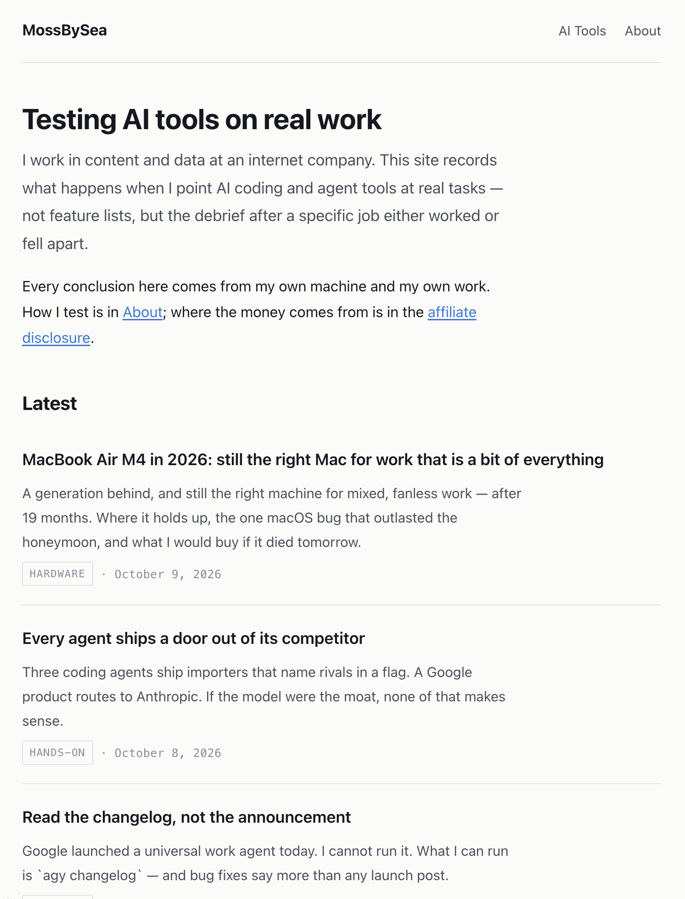
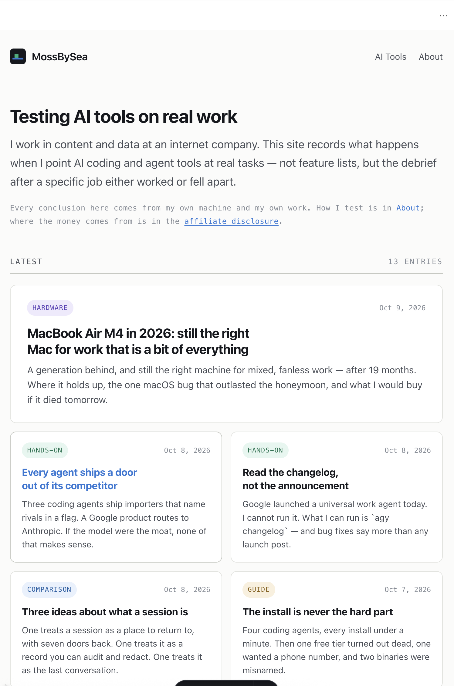

> **Tested** 2026-10-09\
> **Tool** WorkBuddy (desktop agent, one session)\
> **Machine** macOS 15.7, MacBook Air M4\
> **Scope** one real redesign of this site, from "it feels monotone" to a built and verified card layout. Every number below is from the actual session.

## The job

This site was thirteen posts of identical-looking text on a white page. Every entry in the Latest list rendered the same way: a title, a description, a small grey kind label, a hairline between entries. I could not point at anything broken. It was just flat.

My first instinct was the one every tutorial plants: go look at templates, pick a nice one. I typed something like that at the agent — *show me good-looking templates, I want to refresh the visuals*.

What it did instead is the reason I am writing this down.

## It read my stylesheet before recommending anything

The agent opened `global.css` and came back with a diagnosis, not a theme gallery. Four findings, each one checkable against the file:

**Every divider on the site was the same line.** The header's bottom border, each list item, the footer's top border, table frames, blockquotes, `hr` — all one 1px rule in one colour, a variable called `--rule`. Nothing was heavier than anything else, so nothing anchored the eye. That, not the palette, was the physical source of "monotone".

**The largest font on the site was 1.95rem.** My `h1` was smaller than the body text on a lot of blogs. There was no first glance to have.

**The logo contained a green, `#1baf7a`, that appeared nowhere in the stylesheet.** I had a brand colour my visitors had literally never seen. The blue that *was* in use turned out to be the most default link-blue imaginable.

**The logo mark only ever rendered as a favicon.** The header drew the site name as plain text at 1.05rem, barely bigger than the nav links next to it.

This changed the shape of the job. A template swap would have papered over finding one — the divider issue is structural, and most themes I could actually adopt use Tailwind, which would mean rebuilding the whole site on a new styling stack, including the content pipeline and disclosure logic already in place. Editing my own design tokens cost a fraction of that and touched nothing else.

## Three directions, rendered with my actual posts

Then it did something I had not asked for: it built a single HTML file that rendered the same thirteen posts — real titles, real descriptions, real dates — in three visual directions, with a dark-mode toggle:

- **Editorial** — serif display type, one pinned long-form post (the craigmod.com school)
- **Index** — a numbered, dense list where density is the argument (matklad, gwern)
- **Cards** — a grid where the kind label finally becomes visible

And it attached a recommendation to each, including costs. Its advice was B's skeleton with one A moment, and an explicit argument *against* pure cards: grids squash long-form posts into equal squares, and the card look is the visual language of exactly the affiliate content farms this site spends its energy distinguishing itself from.

## I picked C anyway

This is the part I think is worth recording honestly. I read the argument against cards and chose cards.

The agent did not re-litigate. It also did not silently comply. It said, in effect: two of those risks are real, so they get engineered around, not ignored — and then it implemented C with two specific countermeasures. The newest post on the homepage became a full-width featured card with the title and description split into two columns on desktop, which breaks the "everything is the same size" problem at the top of the page. The chips that label each post went low-saturation — pale background, dark text in the same hue, no pill-glossy gradients, no shadows, a restrained 10px radius, descriptions shown in full instead of clamped to one line.

Whether that is the right way for an agent to handle being overruled is a question I am still thinking about. My current answer: this was correct. It treated my choice as a constraint to satisfy well, not an opinion to argue with a second time, and it did not pretend the trade-offs away.

## What shipped

Before — thirteen identical rows, grey labels, no anchor anywhere:

After — the same thirteen posts: one featured card, a grid, and kind labels that finally carry colour (the green from my logo is now the colour of hands-on posts):

Underneath the card layer, the fix that actually matters: dividers are now two weights — a hairline rule inside lists and tables, a stronger rule for section boundaries — and section headings became small mono labels over a heavier line. That change would have improved the site under any of the three directions.

One implementation detail I would not have thought of: the page shell stays one fixed width on every page (so the nav does not jump sideways between pages), and prose pages narrow themselves with a single `main:not(:has(.post-grid))` rule instead of per-page containers. One line governs every page including ones that do not exist yet.

## Two bugs it caught that had nothing to do with design

The redesign session turned up two problems that were never about visuals.

**The homepage order was shuffling between deploys.** Comparing local output against production, the second entry in the Latest list differed. Same source, same commit. The cause: six of my posts share one pubDate and three share another, and sorting by date alone leaves ties ordered by whatever order the build environment happens to read the directory in — which is not guaranteed to match between my machine and Cloudflare's. The fix was a deterministic tiebreak (date descending, then slug ascending). Every future deploy would have reshuffled the homepage without this.

**My own shell was lying to curl.** The machine has an `HTTP_PROXY` environment variable set, so every `curl` to `http://127.0.0.1:4321` came back 502 and looked exactly like "the dev server did not start". The server was fine; the request was detouring through a local proxy. `curl --noproxy '*'` fixed the diagnosis. I had burned time on this class of false negative before without knowing why.

## What the session actually cost

One conversation, most of an afternoon including the writing of this post. Zero rewrites of content. No new dependency, no Tailwind, no theme fork — the whole redesign is design tokens and four component files inside the existing stack. The build still outputs the same twenty pages, and the leak scanner that guards this site's disclosure rules passed untouched.

## The verdict

Two things I would tell someone doing this with an agent:

**Let it diagnose before it decorates.** The most valuable output of this session was not the card grid — it was the paragraph explaining that every divider on my site had identical weight. That finding survived my disagreement with the recommendation; a template gallery would have buried it.

**Overruling the agent is fine. Pretending the stated trade-offs don't exist is not.** I shipped the direction it argued against, and because it wrote the risks down instead of just voicing them, they got solved in the implementation instead of rediscovered in production.
